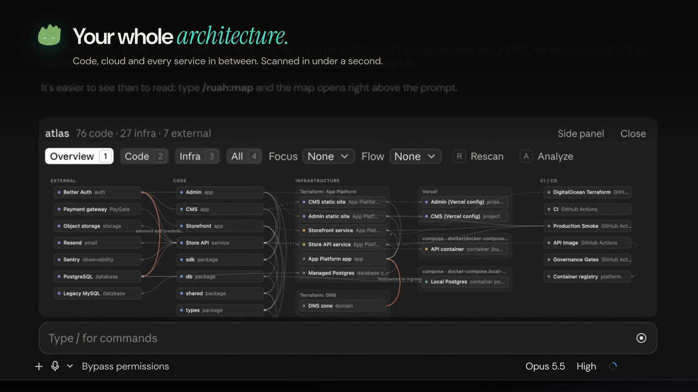
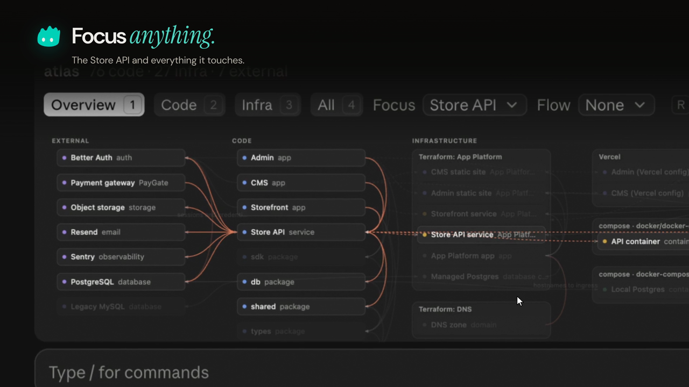
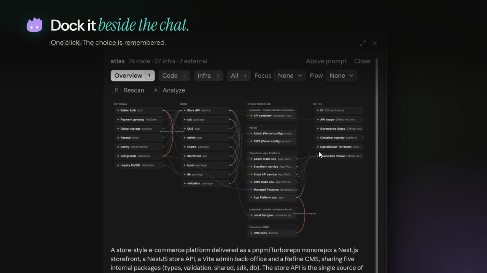

# ruah

**See the architecture of any repo, code and cloud, right inside Claude Code.**

Type `/ruah:map` and a live map of your system opens above the prompt: packages and modules,
the services they call, the infrastructure they deploy to, and the CI that ships them. Claude
then explains it: what each part does, how requests flow through it, and where the risks are.



## What you get

- **One command.** `/ruah:map` scans the repo locally in about a second, no model call needed for the map itself.
- **Code and cloud on one map.** Packages, modules and their imports next to Terraform, Kubernetes,
  Docker Compose, Cloudflare, Vercel, Netlify, Fly, Railway, Render, Firebase, Supabase and CI/CD.
- **Inside Claude Code.** The map lives in a band above the prompt or in a docked side panel
  (one click to move it, the choice is remembered). The terminal gets the same view as an outline.
- **Focus and flows.** Pick any component to light up everything it touches. `/ruah:map deep` has
  Claude trace the main flows step by step (checkout, sign-in, deploy…) and write up risks.
- **Drift, read-only.** `/ruah:map live aws` (or `gcp`, `azure`, `k8s`) compares what the repo
  declares with what is actually deployed, using list/describe calls only.



## Install

In Claude Code:

```
/plugin marketplace add ruah-dev/ruah-map
/plugin install ruah@ruah
```

or from your shell:

```bash
claude plugin marketplace add ruah-dev/ruah-map
claude plugin install ruah@ruah
```

Requires `python3` (3.9+, standard library only). The in-app map panel is a Claude Code mod and
needs Claude Code 2.1.287 or later, where mods are on by default. On claude.ai and in Cowork the
`/ruah:map` skill works and shows the map as an Artifact.

## Commands

| Command | What it does |
|---|---|
| `/ruah:map` | Scan, add a short explanation, show the map |
| `/ruah:map code` · `/ruah:map infra` | Open on the Code or Infra view |
| `/ruah:map deep` | Full analysis: descriptions, code↔infra links, flows and risks |
| `/ruah:map live aws` | Add read-only cloud discovery and drift (`gcp`, `azure`, `k8s` too) |
| `/ruah:map md` | Also write a Mermaid `ARCHITECTURE.md` |
| `/ruah` | Instant map from the mod, no model call (`/ruah side`, `/ruah above`, `/ruah close`) |



## What it reads, runs and sends

ruah is designed to keep your code on your machine.

- **Reads** the files of the repository you map. It never opens `.env` files, credentials,
  `*.tfstate` or private keys; from `.env.example`-style files it reads key names only.
- **Runs** `python3` scripts bundled in this plugin (`scripts/scan.py`, `scripts/render.py`) on your
  machine. They write their output to `<repo>/.ruah/`, which ignores itself in git.
- **Live mode only, and only when you ask for it:** runs the `aws`, `gcloud`, `az` or `kubectl` CLI you
  already have, with read-only list/describe calls, after asking you to confirm the account.
- **Sends nothing anywhere by itself.** No telemetry, no external API calls. Claude reads the scan
  summary and the files it needs in your session, like any other task. If you ask for the map as a
  claude.ai Artifact, Claude publishes it privately to your account.
- **Optional HTML map** (`.ruah/architecture.html`) loads the cytoscape and ELK libraries from
  cdnjs.cloudflare.com and cdn.jsdelivr.net when you open it in a browser.

## What the scanner understands

| Area | Detected |
|---|---|
| Code | package.json, pyproject, requirements, go.mod, Cargo, Maven/Gradle, composer, Gemfile, .csproj; workspaces and monorepos; import graphs for JS/TS (incl. tsconfig paths), Python and Go; frameworks; entrypoints |
| External services | ~100 SDKs (Stripe, Supabase, Firebase, AWS/GCP/Azure, OpenAI/Anthropic/Gemini, Postgres/MySQL/Mongo/Redis, Kafka/RabbitMQ, Sentry/PostHog/Datadog, Resend/SendGrid/Twilio…) |
| Infrastructure as code | Terraform/OpenTofu, CloudFormation & SAM, Serverless Framework, AWS CDK and Pulumi (heuristic), Bicep |
| Containers | Dockerfiles, Docker Compose, Kubernetes (workloads, services, ingress, Istio), Helm |
| Platforms | Cloudflare Workers, Vercel, Netlify, Fly.io, Railway, Render, Heroku, Firebase, Supabase, App Runner, App Engine |
| Data | Prisma and Drizzle schemas |
| CI/CD | GitHub Actions, GitLab, CircleCI, Cloud Build, Azure Pipelines, Bitbucket |

## Sharing maps publicly

Add `<repo>/.ruah/redact.json` to replace names before the map is drawn, for demos and screenshots:

```json
{ "name": "atlas", "hide_git": true, "replace": { "MyCompany": "atlas" }, "patterns": [{ "pattern": "\\b\\d{1,3}(\\.\\d{1,3}){3}\\b", "replace": "<ip>" }] }
```

## Limits

- Import graphs cover JS/TS, Python and Go; other languages get structure and SDK detection only.
- CDK and Pulumi detection is heuristic, and Helm templates are not rendered.

## License

MIT © ruah-dev. Part of the [ruah](https://ruah.sh) toolkit for agentic development.
